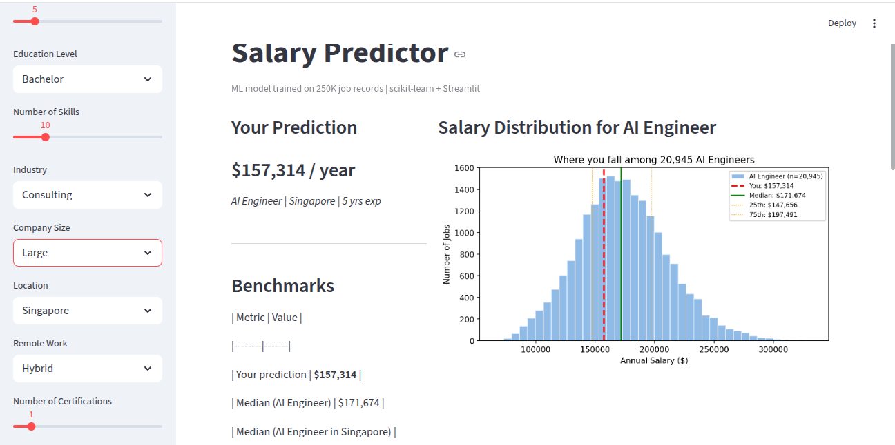

# Salary Predictor

> Machine learning model that predicts annual salary based on job title, experience, education, skills, industry, location, and remote work status. Trained on 250K job records using scikit-learn.

**🔗 Live App:** [https://your-name-salary-predictor.streamlit.app](https://your-name-salary-predictor.streamlit.app)



---

## Problem

Understanding what factors drive salary — and by how much — is valuable for job seekers negotiating offers and for HR teams building fair compensation bands. This project builds a regression model that estimates annual salary from 9 input features, compares 3 algorithms, and deploys the best one as an interactive web app with **per-prediction benchmarks and what-if analysis**.


**Data flow:**
`CSV → Preprocessing (OneHot + Scale) → Train 3 models → Save best → Streamlit (predict + explain)`

---

## Tech Stack

| Layer | Technology | Purpose |
|-------|-----------|---------|
| Language | Python 3.10+ | All logic |
| ML | scikit-learn | Linear Regression, Random Forest, Gradient Boosting |
| Data | Pandas, NumPy | Loading, cleaning, feature engineering |
| Visualization | Matplotlib, Seaborn | EDA plots, distribution charts |
| Web App | Streamlit | Interactive prediction + what-if analysis |
| Model Storage | joblib | Serialize trained pipeline |


---

## Setup

### Prerequisites

- Python 3.10+
- ~2 GB free disk space

### 1. Clone & Install

```bash
git clone https://github.com/YOUR_USERNAME/salary-predictor.git
cd salary-predictor

python3 -m venv venv
source venv/bin/activate
pip install -r requirements.txt   


2. Get Data
Download from Kaggle: 250K Job Salary Prediction Dataset and place in:

data/salary_data.csv

3. Train the Model
cd src
python train.py
cd ..

4. Run the App
cd streamlit_app
streamlit run app.py

Open http://localhost:8501.

| Model | R² | MAE | RMSE |
|-------|-----|------|------|
| Linear Regression | 0.9635 | $5,436 | $7,126 |
| **Random Forest** | **0.9713** | **$5,015** | **$6,320** |
| Gradient Boosting | 0.9493 | $6,595 | $8,392 |

Winner: Random Forest — best R² and lowest error. Tree ensembles with 100+ trees handle noisy, high-cardinality categorical features (like location with many countries) better than Gradient Boosting on this dataset.


| Feature | Type | Description |
|---------|------|-------------|
| `job_title` | Categorical | AI Engineer, Data Analyst, Software Developer, etc. |
| `experience_years` | Numerical | 0–40 years |
| `education_level` | Categorical | High School → PhD |
| `skills_count` | Numerical | Number of technical skills |
| `industry` | Categorical | Healthcare, Finance, Tech, Telecom, etc. |
| `company_size` | Categorical | Small, Medium, Large, Enterprise |
| `location` | Categorical | Country/city |
| `remote_work` | Categorical | Yes / No / Hybrid |
| `certifications` | Numerical | Number of professional certs |


| Section | What it shows |
|---------|---------------|
| **Prediction** | Your estimated annual salary (big number) |
| **Benchmarks table** | Your prediction vs. job median vs. job+location median vs. overall median |
| **Percentile** | "You're in the 44th percentile among 20,945 AI Engineers" |
| **Distribution plot** | Histogram of same-job salaries with your position marked (red), median (green), 25th/75th (orange) |
| **What-If Analysis** | Interactive charts: "What if I had 15 years?" / "What if I moved to USA?" / "What if I went remote?" |


| Decision | Rationale |
|----------|-----------|
| **ColumnTransformer** | Handles mixed types (categorical + numerical) in one pipeline — no manual encoding |
| **OneHotEncoder (not LabelEncoder)** | Avoids implying ordinality to the model |
| **StandardScaler on numerics** | Linear Regression is sensitive to scale; one pipeline works for all 3 models |
| **Random Forest as best** | Best R² on this dataset; handles high-cardinality categoricals well |
| **joblib (not pickle)** | Faster for large numpy arrays inside the model |
| **Notebook + src/ split** | Notebook for exploration; src/ for reproducible, testable production code |
| **Per-prediction benchmarks** | More useful than static feature importance — answers "why did *I* get this number?" |
| **What-If section** | Shows causal effect of each feature, making the model interpretable to non-technical users |


What I Learned
- End-to-end ML workflow: EDA → feature engineering → model selection → deployment
- ColumnTransformer + Pipeline for clean, reproducible preprocessing
- When to use OneHot vs. Ordinal encoding
- Trade-offs between model complexity and interpretability
- Model persistence with joblib for deployment
- Making ML models explainable through benchmarks and what-if analysis (not just feature importance)
- Streamlit for rapid ML prototyping with interactive charts

